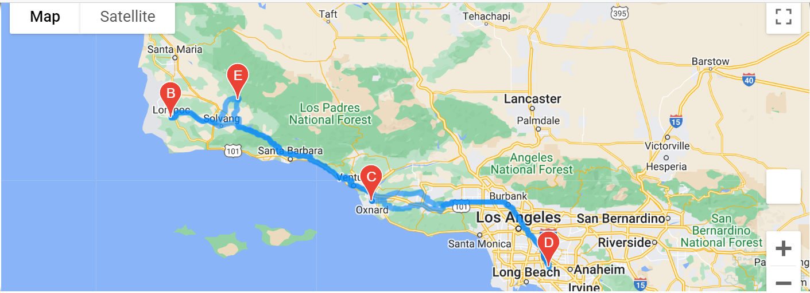

# World_Weather_Analysis

## Overview:

### During this project we are helping PlanMyTrip analysis team collect and present data for customers via the search page on their app. The goal is to be able to provide customers and travelers with enough insights and information to plan their trips.
### Our Challenge analysis was divided into three different analysis, Weather Database, Vacation Search, and Vacation Itinerary.

### In the Weather Database analysis, we used the Open Weather API to gather current weather data. We initially started with 2000 random latitudes and longitudes coordinates, and ended up analyzing over 700 destinations/cities. The search critirea included data such as:

* Max Temperature.
* Cloudiness.
* Wind speed.
* Humidity.
* Current Weather Description (such as clouds, fog, light rain, clear sky, etc..)

### This analysis helped travelers preselect and filter specific conditions prior to booking/deciding on their travel destination.

### Our next analysis was the Vacation Search, in which we utilized Google Maps API, on the previously recorded information from the Weather Database. The Gmaps API helped us plot different cities in the world based on the specific criteria searched for, the image below shows the locations for all the cities gathered, in which minimum and maximum temperatures were between 75 and 95 degrees, Fahrenheit.

### In the Vacation Itinerary folder, we used the Gmaps Directions API to create an itinerary for our customers' vacations. In the image below, we used the information previsouly gathered in the Vacation Search for four cities/stops in the state of California and created an itinerary for the trip, with a method of traveling chosen is "walking". We are also able to use markers to locate a hotel within each of the four cities to be visited, and display it in our plot.

